<!-- README.md is generated from README.Rmd. Please edit that file -->

# MD-ALL

### Molecular Diagnosis of Acute Lymphoblastic Leukemia

<strong>MD-ALL</strong> is designed to perform subtyping of B-cell acute
lymphoblastic leukemia (B-ALL) using bulk RNA-seq or single-cell RNA-seq
(scRNA-seq) data. The minimum input required for bulk RNA-seq analysis
is the gene expression read count output from bioinformatics tools, such
as
[HTSeq-count](https://htseq.readthedocs.io/en/release_0.11.1/count.html)
and
[FeatureCount](https://academic.oup.com/bioinformatics/article/30/7/923/232889).
By uploading additional VCF files and raw outputs of fusion callers
([FusionCatcher](https://github.com/ndaniel/fusioncatcher) and/or
[Cicero](https://github.com/stjude/CICERO)), MD-ALL can detect
B-ALL-related mutations and fussions in test sample and run
[RNAseqCNV](https://www.nature.com/articles/s41375-022-01547-8) to
determine chromosome-level CNVs as well as iAMP21. MD-ALL can classify
B-ALL cases into a total of 26 subtypes using bulk RNA-seq data. For
scRNA-seq analysis, only a gene (per row) x cell (per column) expression
matrix is needed. MD-ALL is a one-stop platform for sensitive, accurate,
and comprehensive B-ALL subtyping based on RNA-seq data.

The workflow of MD-ALL: <br>


<br> <br>

## 1\. Installation

### Install R and RStudio

MD-ALL is implemented in R. To ensure a better user experience, we
recommend installing RStudio. Before using MD-ALL, please ensure that
you have installed [R](https://www.r-project.org/) and
[RStudio](https://posit.co/download/rstudio-desktop/). <br> <br>

### Install required packages

The following codes will check the packages already exist and install
all the missing ones and MD-ALL. Please note that
[RTools](https://cloud.r-project.org/) is also required for the
installation of the MD-ALL package.

``` r
#Get installed list of pacakges
installedPackages=  installed.packages()[,"Package"]

#Install CRAN R packages
list.of.packages=c("devtools", "BiocManager","dplyr","stringr","Seurat",
                   "ggplot2","ggrepel","cowplot","umap",
                   "shiny","shinyjs","shinydashboard")

new.packages = list.of.packages[!(list.of.packages %in% installedPackages)]
if(length(new.packages)){
  install.packages(new.packages)
}

#Install Bioconductor R packages
list.of.bioconductor.packages = c("DESeq2", "SingleR","SummarizedExperiment")
new.bioconductor.packages = list.of.bioconductor.packages[!(list.of.bioconductor.packages %in% installedPackages)]

if (length(new.bioconductor.packages)) {
  BiocManager::install(new.bioconductor.packages)
}

#Install PhenoGrapth
if(!"Rphenograph" %in% installedPackages){
  devtools::install_github("JinmiaoChenLab/Rphenograph")
}

#Install MD-ALL
devtools::install_github("gu-lab20/MD-ALL")
```

If you want to install using the script, you can download the
installation
[script](https://github.com/gu-lab20/MD-ALL/raw/master/R/install_required_packages.R)
and run it in RStudio.

## 2\. Start MD-ALL ShinyApp

#### Luanch the APP

``` r
library(MDALL)
run_shiny_MDALL()
```

After launching the Shiny app, users can select the analysis for either
bulk RNA-seq or scRNA-seq data from the left sidebar. In the analysis
for bulk RNA-seq, three modes are available: Single Sample, Multiple
Samples, and Count Matrix Only. <br> <br>

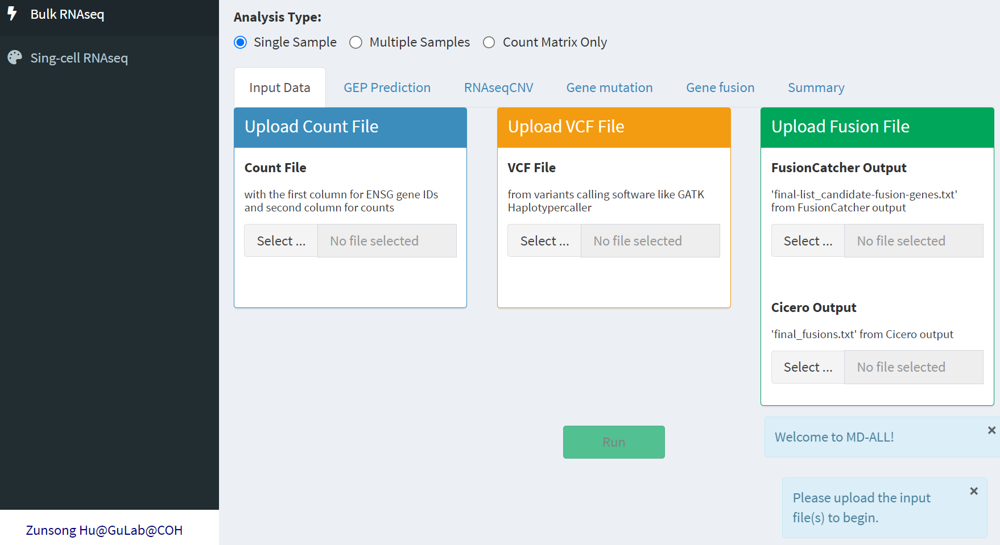
<br> <br>

## 3 Analysis for bulk RNA-seq data (Single Sample)

#### 3.1 Upload data

To run the analysis for bulk RNA-seq data in the Single Sample mode,
please upload at least the read count file. This mode is for the
analysis of only one sample. For analysis of mulitple samples, please
check section 4. MD-ALL also accepts VCF files and the raw outputs from
fusion callers (MD-ALL supports FusionCatcher and Cicero) to perform
more accurate B-ALL subtype classification. If the VCF and fusion
calling files are missing, the output will be solely based on gene
expression profile (GEP). <br> <br> After uploading the input files,
click the ‘Run’ button, and MD-ALL will start the analysis. The running
time is around 3-5 minutes per sample using a standard desktop. Users
can speed up the process by doing fewer rounds of GEP-based subtype
prediction. The default parameter includes all gene number options.
Please note that the parameters will not be displayed until the input
files are successfully uploaded. <br> <br> To test MD-ALL, users can
download the testing files in the
[‘tests.zip’](https://github.com/gu-lab20/MD-ALL/raw/master/tests.zip)
file from this GitHub repository. <br> <br>

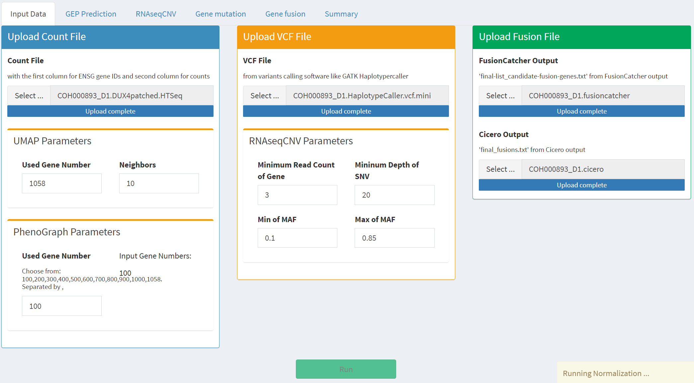
<br> <br>

The following are examples of code used in the analysis of [GATK
HaplotyperCaller](https://gatk.broadinstitute.org/hc/en-us/articles/13832687299739-HaplotypeCaller)
to obtain the VCF file, which will serve as input in the subsequent
RNAseqCNV and B-ALL mutations calling analysis. The codes start from
.bam file. <br> <br>

``` bash
gatk SplitNCigarReads \
-R GRCh38.fa \
-I sample.bam \
-O sample.SplitNCigarReads.bam 

gatk HaplotypeCaller \
--dont-use-soft-clipped-bases \
-R GRCh38.fa \
-I sample.SplitNCigarReads.bam \
-O sample.HaplotypeCaller.vcf
```

<br> <br>

#### 3.2 Gene expression results

The ‘GEP Prediction’ tab contains results for GEP that are based on the
read count file. <br> <br> The top two panels show the head and tail of
the raw count file and the results after normalization using VST from
DESeq2. <br> <br> The left plot panel contains the prediction heatmap on
top and the UMAP at the bottom.  
The color of the prediction heatmap indicates the predicted B-ALL
subtypes for the testing sample.  
The UMAP includes the 1821 reference B-ALL samples representing a total
of 19 subtypes with distinct GEPs. The mapping of the testing sample is
also highlighted on the UMAP. <br> <br> The right panel contains a gene
expression box plot, which allows users to check the expression levels
of coding genes, particularly the feature genes for certain subtypes.
For instance, NUTM1 is the feature gene for the NUTM1 subtype, so users
can check its expression level when the prediction shows that the
subtype is NUTM1 to confirm this subtype. The same condition also
applies to CDX2 gene for CDX2/UBTF subtype and HLF gene for HLF subtype.
Another scenario is to confirm the high expression of CRLF2 gene when a
CRLF2 fusion is detected. It is also convenient to check the expression
level of any genes of interest across B-ALL subtypes using this box
plot.

Based on the GEP prediction results in this following figure, it can be
inferred that the testing sample is likely to be a Ph/-like case with
high CRLF2 expression. <br> <br>


#### 3.3 RNAseqCNV results

The ‘RNAseqCNV’ tab contains results for the analysis of RNAseqCNV. Both
the read count file and VCF file are required for this analysis. Please
refer to the
[RNAseqCNV](https://www.nature.com/articles/s41375-022-01547-8) paper
for more details. Briefly, chromosome gain leads to an overall higher
expression of the genes on that chromosome, while chromosome loss leads
to lower expression at the chromosome level. With chromosome gain or
loss, the distribution of minor allele frequency (MAF) of common SNPs
becomes skewed. The peak of the MAF distribution on normal diploid
chromosomes is around 0.5. RNAseqCNV can also identify iAMP21 as we
described in our manuscript. <br> <br> In the following figure, we can
see a higher overall expression for chr9 and chrX, as well as a skewed
distribution (shown in red line) of MAF, indicating gain of chr9 and
chrX. <br> <br>

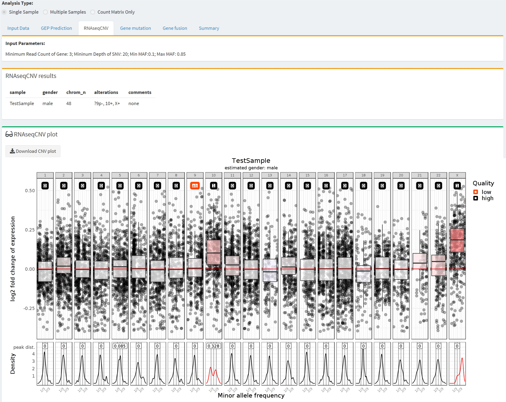

<br> <br>

#### 3.4 Mutation results

The ‘Gene mutation’ tab will display B-ALL-related mutations detected in
the VCF file.  
The ‘B-ALL Mutations’ panel will show known B-ALL mutations (as we
describe in our manuscript) detected in this sample.  
The ‘B-ALL Subtype Defining Mutations’ panel will display the B-ALL
subtype-defining mutations (PAX5:P80R, IKZF1:N159Y, and ZEB2:H1038R)
tested for this purpose.

This figure indicates that no B-ALL mutations were detected in the VCF
file of this possible Ph/-like case.
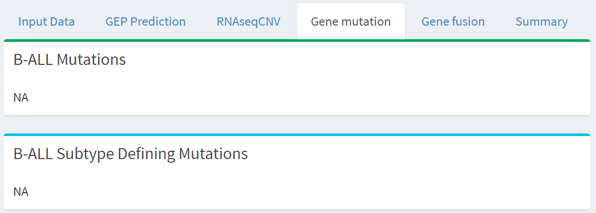
<br> <br>

Another example of mutation results is as follows: a PAX5:P80R mutation
was detected, which is the definitive mutation for the PAX5 P80R
subtype.
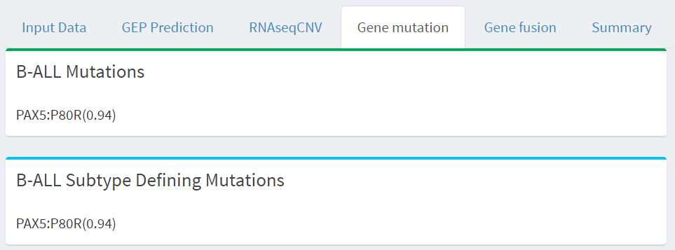
<br> <br>

#### 3.5 Fusion results

If the output files from FusionCathcer and/or Cicero are uploaded,
B-ALL-related fusions will be listed as in the following figure. Please
be aware that fusions supported by a low number of reads may not be
reliable. <br> <br>

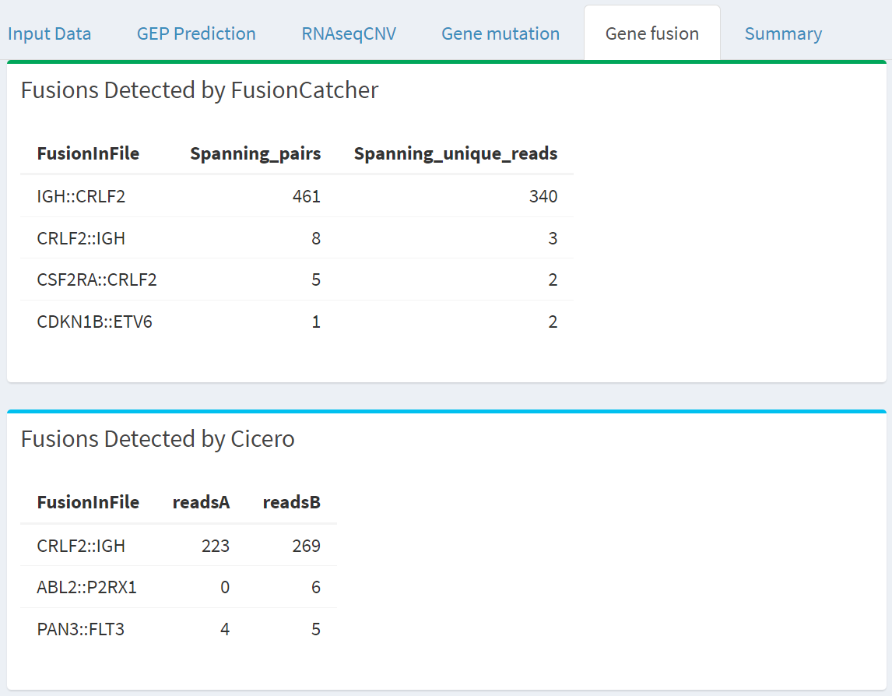

#### 3.6 Subtype summary

A summary of the analyses will be displayed under the “Summary” tab,
along with the predicted final subtype, which will integrate the
information from genetic alterations and GEP, shown in the last panel.
Please note that the fusions listed in the ‘Genetic Alteration’ panel
will only include fusions related to the final subtype. A final subtype
will be generated automatically only if consistent predictions are
obtained from both PhenoGraph and SVM. Otherwise, user judgment is
required. <br> <br> For this case, the GEP prediction indicated a
Ph/-like subtype with high accuracy because both PhenoGraph and SVM
achieved 100% confidence score. This case has no BCR::ABL1 fusion but
multiple CRLF2 rearrangements, a signature event for Ph-like subtype,
which lead to definitive classification of this test sample as Ph-like
subtype. <br> <br>

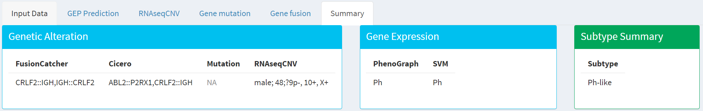

## 4 Analysis for bulk RNA-seq data (Multiple Samples)

#### 4.1 Upload data

For analysis of multiple samples, users can use the ‘Multiple Samples’
mode. Firstly, the users need to prepare the metadata table containing
the filenames of the read count, VCF, FusionCatcher, and Cicero outputs,
as shown below:
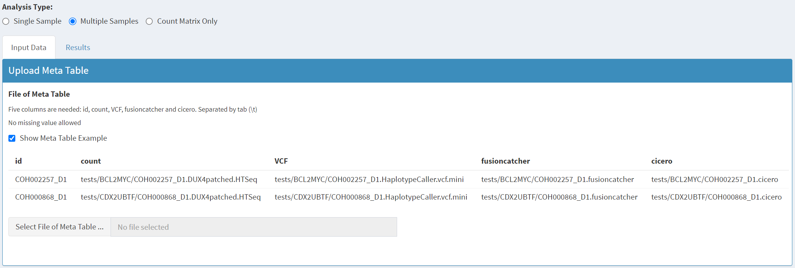
<br> <br>

After uploading the correct metadata table, the parameters of MD-ALL
will appear, just like in ‘Single Sample’ mode. Users can click the
“Run” button to start the analysis.
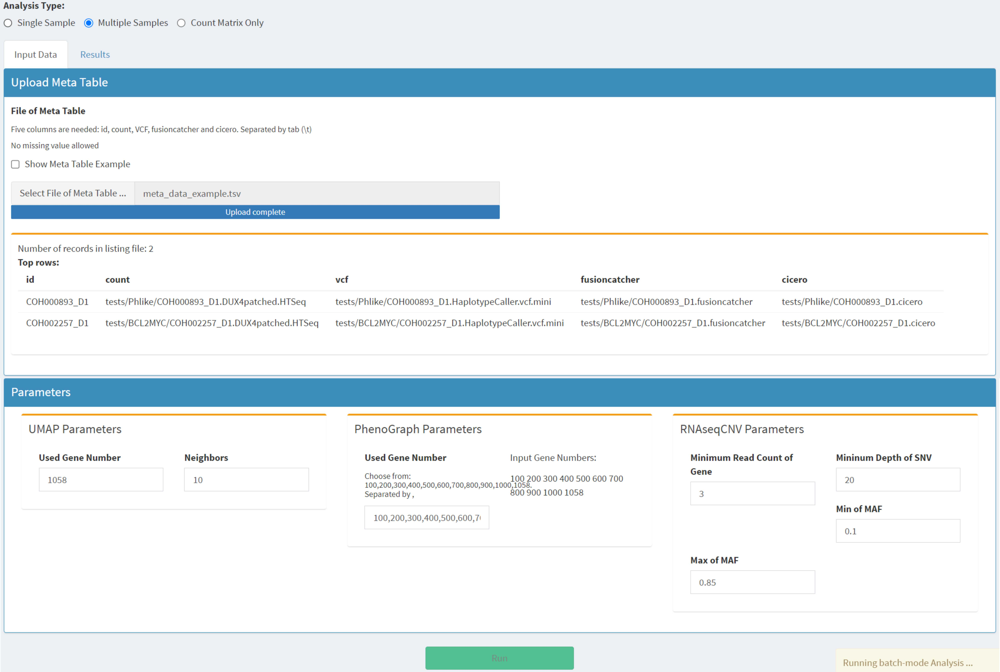
<br> <br>

#### 4.2 Results for bulk RNA-seq analysis in ‘Multiple Samples’ mode

After all the analyses are done, users can check the results in the
‘Results’ tab. Select the sample ID in the top left panel, and the
MD-ALL summary in the top right panel will update according to the
selected sample ID. The bottom panel contains the results of GEP and
RNAseqCNV; users can check these results using the ‘GEP’ and ‘RNAseqCNV’
tabs.

Results showing GEP in the ‘Multiple Samples’ mode:
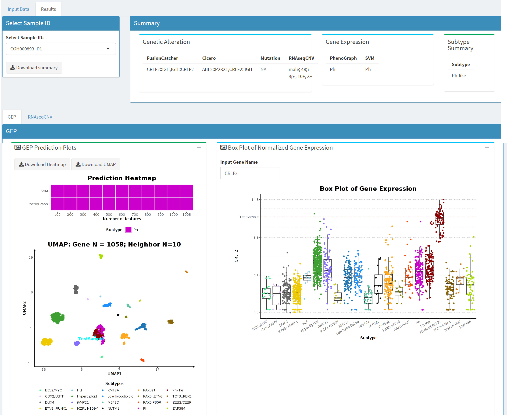
<br> <br>

Results showing RNAseqCNV in the ‘Multiple Samples’ mode:
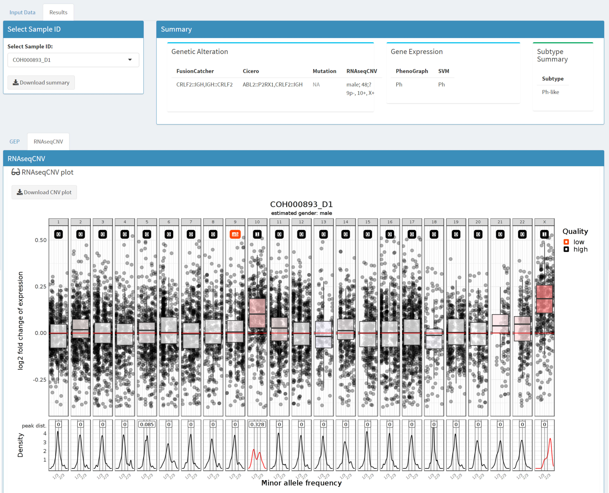
<br> <br>

## 5 Analysis for bulk RNA-seq data (Count Matrix Only)

#### 5.1 Upload data

For users who only have the gene read count matrix, MD-ALL offers the
‘Count Matrix Only’ mode. The input data should be a read count matrix
with rows representing genes and columns representing samples; the first
column should be the ENSG gene IDs. After uploading the read count
matrix, the parameters will appear and users can click the ‘Run’ button
to start the
analysis.


<br> <br>

#### 5.2 Results for bulk RNA-seq analysis in Count Matrix Only mode

The ‘Count Matrix Only’ mode only contains the results of GEP, since no
other types of input are used. Users can check the results after the
analysis is done. Users can still select the sample IDs in the top left
panel, and the other parts will update
accordingly:

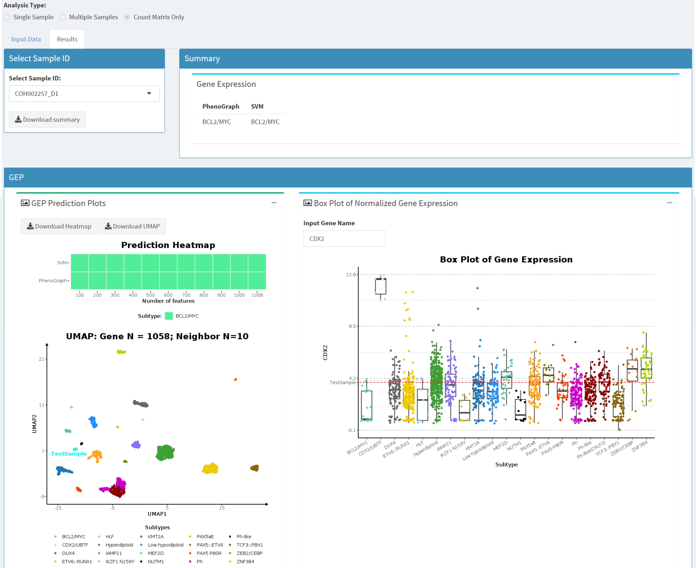
<br> <br>

## 6 Analysis for scRNA-seq data

#### 6.1 Upload data for scRNA-seq analysis

The input file for scRNA-seq analysis is the count matrix of single
cells with rows for genes and columns for cells. The
‘countMatrix\_singlecell.tsv’ file in the same
[‘tests.zip’](https://github.com/gu-lab20/MD-ALL/raw/master/tests.zip)
zip file can be used for testing.

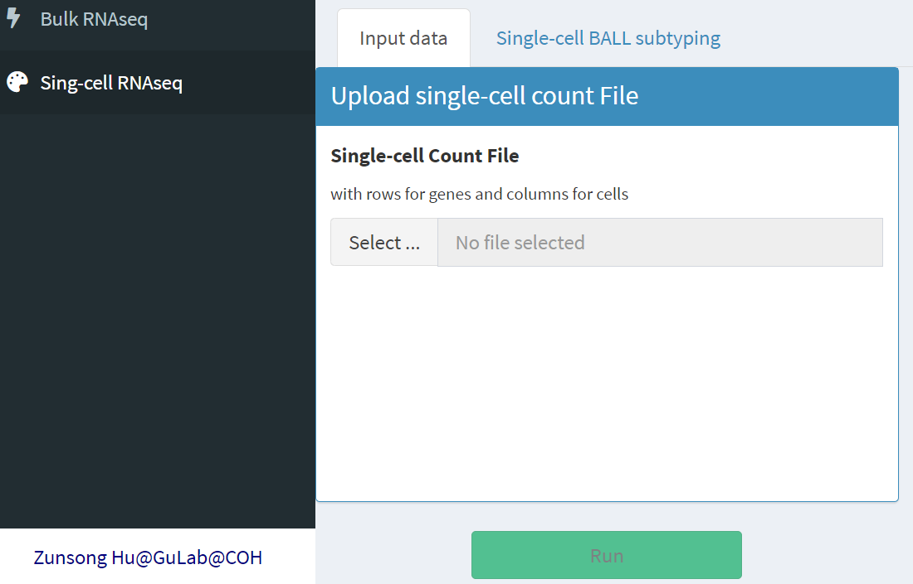

#### 6.2 Results of B-ALL subtyping using scRNA-seq data

Three UMAPs of single cells are shown on the left side. The top UMAP is
colored by different cell types. The middle UMAP shows the cells
belonging to pre-B and pro-B cells, which were used for the purpose of
B-ALL subtyping. The bottom UMAP shows the cells colored by the
annotation of different B-ALL subtypes. <br> <br> The bar plot on the
right side gives the percentages of each cell type with the pre-B and
pro-B cells as one big group and the rest as the other group. The
heatmap on the right side shows the scaled correlation score calculated
by the
[SingleR](https://bioconductor.org/packages/release/bioc/html/SingleR.html)
package. The higher the correlation score, the more likely that the cell
belongs to that subtype. <br> <br> As shown in the bottom UMAP and the
heatmap, most of the pre-B and pro-B cells are annotated as Hyperdiploid
subtype with high correlation scores. The percentage of the cells
annotated to Hyperdiploid among pre-B and pro-B cells were more than
97%, indicating that this sample is a Hyperdiploid case based on
scRNA-seq GEP. <br> <br>


<br> <br>

### Contact:

Zunsong Hu: <zuhu@coh.org>

Zhaohui Gu: <zgu@coh.org> <br> <br>
