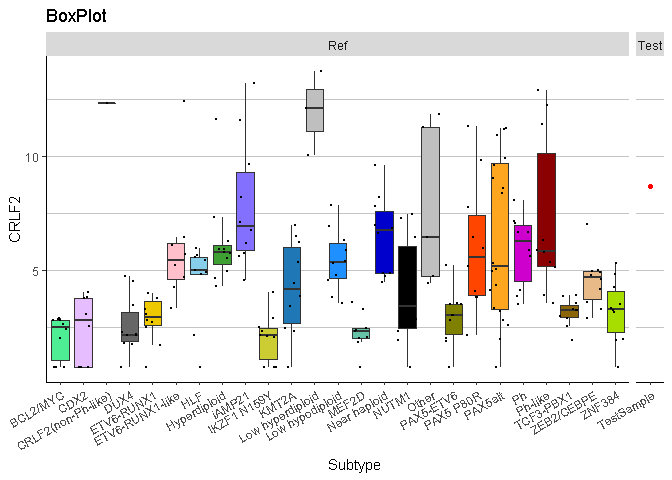
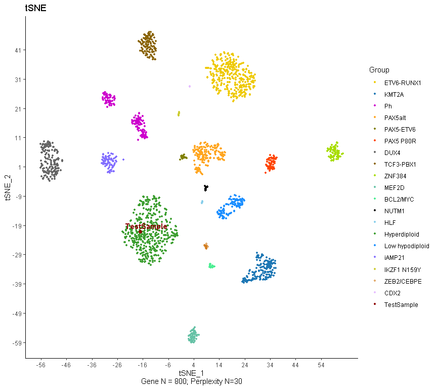
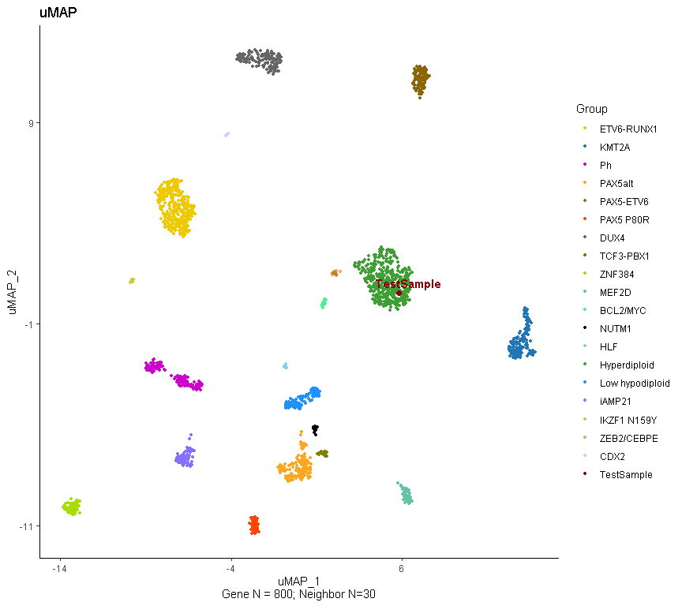
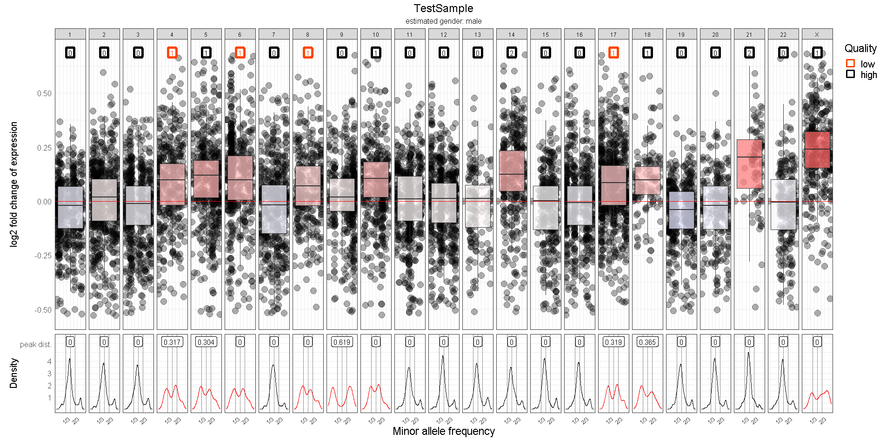

<!-- README.md is generated from README.Rmd. Please edit that file -->

# MD-ALL

#### Molecular Diagnosis of Acute Lymphoblastic Leukemia

## Installation

### Install required packages

Install DEseq2 BiocManager::install(“DESeq2”)

Install Rphenograph
devtools::install\_github(“JinmiaoChenLab/Rphenograph”)

### Install MD-ALL

You can install the released version of MD-ALL from
[github](https://github.com/gu-lab20/MD-ALL).

| Type        | Command                                       |
| ----------- | --------------------------------------------- |
| Development | `devtools::install_github("gu-lab20/MD-ALL")` |

## Load required library

``` r
library(dplyr)
library(stringr)
library(Rtsne)
library(umap)
library(Rphenograph)
library(ggplot2)
library(ggrepel)
library(ggpubr)
library(SummarizedExperiment)
library(shiny)
library(shinydashboard)
library(MDALL)
```

## Use ShinyApp

#### shinyApp(ui=shinyApp\_ui(),server=shinyApp\_server)

## Import data

The count data can be imported directory from a txt file, separated by
space, tab or common. The HTSeqCount generated gene level count are
accepted for now. Later we will add the support for featureCounts. The
ENSG id should be used as the gene name.

``` r
df_count=read_input("tests/Hyperdiploid.HTSeq",delimiter = "\t",header = F)
dim(df_count)
#> [1] 60622     2
head(df_count)
#>           feature TestSample
#> 1 ENSG00000000003         26
#> 2 ENSG00000000005          0
#> 3 ENSG00000000419       1599
#> 4 ENSG00000000457       1435
#> 5 ENSG00000000460       1534
#> 6 ENSG00000000938        470
```

## Normalization

Normalization with reference data

``` r
df_vst=get_vst_values(obj_in = obj_234_HTSeq,df_count = df_count)
#> Running vst
dim(df_vst)
#> [1] 60616     2
head(df_vst)
#>                         feature TestSample
#> ENSG00000000003 ENSG00000000003   4.172219
#> ENSG00000000005 ENSG00000000005   0.743980
#> ENSG00000000419 ENSG00000000419   9.838695
#> ENSG00000000457 ENSG00000000457   9.683178
#> ENSG00000000460 ENSG00000000460   9.779047
#> ENSG00000000938 ENSG00000000938   8.084830
```

## Get gene expression box plot

``` r
obj_boxplot=obj_merge(obj_in = obj_234_HTSeq,df_in = df_vst,assay_name_in = "vst")
draw_BoxPlot(obj_in = obj_boxplot,group.by = "diag",features = "CRLF2",highlightLevel = "TestSample")
```



## Get normalized expression values for feature genes

``` r
get_geneExpression(df_vst = df_vst,genes = c("CDX2","CRLF2","DUX4"))
#>    Gene Expression
#> 1  CDX2   5.543875
#> 2 CRLF2   8.655736
#> 3  DUX4   1.903389
```

## Add testing sample to reference dataset for subtype prediction

``` r
obj_=obj_merge(obj_in = obj_2042_HTSeq,df_in = df_vst,assay_name_in = "vst")
```

## Run tSNE

``` r
obj_=run_tsne(obj_in = obj_,out_label = "tsne",feature_panel = "boruta_genes")
#> Run tSNE: Used Feature N= 800 ; Used Sample N= 2043 ; Perplexity= 30

df_tsne=get_embeding_feature(obj_in = obj_,features = c("diag"))
knn_pred_one(indata = df_tsne,var_y = "diag", var_x = c("tSNE_1","tSNE_2"))[which(df_tsne$diag=="TestSample")]
#> [1] "Hyperdiploid"
```

## Draw tSNE plot

``` r
draw_DimPlot(obj_,group.by = "diag",reduction = "tsne",highlightLevel = "TestSample")
```



## Run uMAP

``` r
obj_=run_umap(obj_in = obj_,out_label = "umap",n_neighbors = 30,variable_n = 800,feature_panel = "boruta_genes")
#> Running uMAP: Feature N= 800 ; Sample N= 2043 ; n_neighbors= 30

df_umap=get_embeding_feature(obj_in = obj_,features = c("diag"),reduction = "umap")
knn_pred_one(indata = df_umap,var_y = "diag", var_x = c("uMAP_1","uMAP_2"))[which(df_tsne$diag=="TestSample")]
#> [1] "Hyperdiploid"
```

## Draw uMAP plot

``` r
draw_DimPlot(obj_,group.by = "diag",reduction = "umap",highlightLevel = "TestSample")
```



## Run PhenoGraph clustering

``` r
obj_=run_PhenoGraph(obj_in = obj_,feature_panel = "boruta_genes",variable_n = 800,neighbor_k = 30)
#> Run Phenograph: Used Feature N= 800 ; Used Sample N= 2043 ; Neighbor_k= 30 
#>   Finding nearest neighbors...DONE ~ 2.89 s
#>   Compute jaccard coefficient between nearest-neighbor sets...DONE ~ 0.79 s
#>   Build undirected graph from the weighted links...DONE ~ 0.25 s
#>   Run louvain clustering on the graph ...DONE ~ 0.06 s
#>   Return a community class
#>   -Modularity value: 0.9039955 
#>   -Number of clusters: 15

get_PhenoGraphPred(obj_)$value
#> [1] "PhenoGraph Clustering Labeled Subtype: Hyperdiploid (FeatureN=800; NeighborN=30)"
```

## Run RNAseqCNV

``` r
RNAseqCNV_out=run_RNAseqCNV(df_count = df_count,snv_file = "tests/Hyperdiploid.vcf")
#> [1] "Normalization for sample: TestSample completed"
#> [1] "Preparing file with snv information for: TestSample"
#> [1] "Estimating chromosome arm CNV: TestSample"
RNAseqCNV_out$df_cnv_out
#>       sample gender chrom_n
#> 1 TestSample   male      54
#>                                                              alterations
#> 1 ?4+, 5+, ?6+, 8p+, ?8q+, 10+, 14+, 14+, ?17p+, 17q+, 18+, 21+, 21+, X+
#>        status comments
#> 1 not checked     none
```

## Draw RNAseqCNV Plot

``` r
get_RNAseqCNV_plot(RNAseqCNV_out=RNAseqCNV_out)
```



## Get mutations

``` r
out_mutation=get_BALL_mutation("tests/Hyperdiploid.vcf")

out_mutation$out_text_BALLmutation
#> [1] "KRAS: G12D" "KRAS: G13D"
```

## Get fusions called by FuisonCatcher

``` r
get_BALL_fusion("tests/iAMP21.fusioncatcher",type = "fc")
#> # A tibble: 12 x 7
#>    FusionInFile  Spanning_pairs Spanning_unique_r~ FusionFeature RelatedSubtype 
#>    <chr>                  <int>              <int> <chr>         <chr>          
#>  1 CRLF2::CSF2RA              6                  1 CRLF2         CRLF2(non-Ph-l~
#>  2 CSF2RA::CRLF2              6                  1 CRLF2         CRLF2(non-Ph-l~
#>  3 P2RY8::CRLF2              82                 48 CRLF2         CRLF2(non-Ph-l~
#>  4 P2RY8::CRLF2              82                 48 P2RY8         CRLF2(non-Ph-l~
#>  5 CRLF2::CSF2RA              6                  1 CSF2RA        CRLF2(non-Ph-l~
#>  6 CSF2RA::CRLF2              6                  1 CSF2RA        CRLF2(non-Ph-l~
#>  7 P2RY8::CRLF2              82                 48 P2RY8::CRLF2  iAMP21         
#>  8 P2RY8::CRLF2              82                 48 P2RY8::CRLF2  Ph-like        
#>  9 CRLF2::CSF2RA              6                  1 CRLF2         Ph-like        
#> 10 CSF2RA::CRLF2              6                  1 CRLF2         Ph-like        
#> 11 P2RY8::CRLF2              82                 48 CRLF2         Ph-like        
#> 12 EBF1::JAK2                 3                  2 JAK2          Ph-like        
#> # ... with 2 more variables: SubtypeSignificance <chr>,
#> #   ConfidenceToRelatedSubtype <chr>
```

## Get fusions called by Cicero

``` r
get_BALL_fusion("tests/iAMP21.cicero",type = "c")
#> # A tibble: 10 x 7
#>    FusionInFile readsA readsB FusionFeature RelatedSubtype     SubtypeSignifica~
#>    <chr>         <int>  <int> <chr>         <chr>              <chr>            
#>  1 P2RY8::CRLF2      0    107 CRLF2         CRLF2(non-Ph-like) CRLF2 fusion     
#>  2 PDE5A::CRLF2      0     14 CRLF2         CRLF2(non-Ph-like) CRLF2 fusion     
#>  3 USH2A::CRLF2      0      4 CRLF2         CRLF2(non-Ph-like) CRLF2 fusion     
#>  4 P2RY8::CRLF2      0    107 P2RY8         CRLF2(non-Ph-like) adjacent to CRLF2
#>  5 IKZF1::IFI16      0      9 IKZF1         ETV6-RUNX1-like    IKZF1 fusion     
#>  6 P2RY8::CRLF2      0    107 P2RY8::CRLF2  iAMP21             featured lesion  
#>  7 P2RY8::CRLF2      0    107 P2RY8::CRLF2  Ph-like            featured fusion  
#>  8 P2RY8::CRLF2      0    107 CRLF2         Ph-like            featured fusion  
#>  9 PDE5A::CRLF2      0     14 CRLF2         Ph-like            featured fusion  
#> 10 USH2A::CRLF2      0      4 CRLF2         Ph-like            featured fusion  
#> # ... with 1 more variable: ConfidenceToRelatedSubtype <chr>
```
