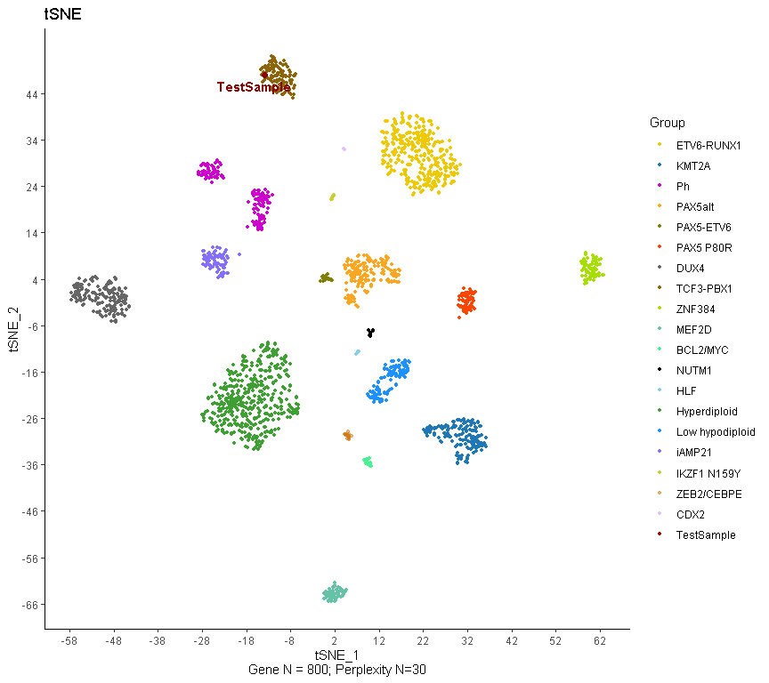

<!-- README.md is generated from README.Rmd. Please edit that file -->

# MD-ALL

#### Molecular Diagnosis of Acute Lymphoblastic Leukemia

## Installation

You can install the released version of MD-ALL from
[github](https://github.com/gu-lab20/MD-ALL).

| Type        | Command                                       |
| ----------- | --------------------------------------------- |
| Development | `devtools::install_github("gu-lab20/MD-ALL")` |

## Load required library

``` r
library(MDALL)
library(dplyr)
library(Rtsne)
library(ggplot2)
library(ggrepel)
library(umap)
library(Rphenograph)
library(SummarizedExperiment)
```

## Import data

The count data can be imported directory from a txt file, separated by
space, tab or common. The HTSeqCount generated gene level count are
accepted for now. Later we will add the support for featureCounts. The
ENSG id should be used as the gene name.

``` r
df_count=read_input("tests/test.HTSeqCount",delimiter = "\t",header = F)
dim(df_count)
#> [1] 60616     2
head(df_count)
#>           feature TestSample
#> 1 ENSG00000000003          4
#> 2 ENSG00000000005          0
#> 3 ENSG00000000419        911
#> 4 ENSG00000000457        327
#> 5 ENSG00000000460        501
#> 6 ENSG00000000938       2099
tail(df_count)
#>               feature TestSample
#> 60611 ENSG00000288667          0
#> 60612 ENSG00000288669          0
#> 60613 ENSG00000288670         44
#> 60614 ENSG00000288671          0
#> 60615 ENSG00000288674         27
#> 60616 ENSG00000288675         15
```

## Normalization

Normalization with reference data

``` r
df_vst=get_vst_values(obj_in = obj_234_HTSeq,df_count = df_count)
#> Running vst
dim(df_vst)
#> [1] 60616     2
head(df_vst)
#>                         feature TestSample
#> ENSG00000000003 ENSG00000000003   2.677606
#> ENSG00000000005 ENSG00000000005   0.747142
#> ENSG00000000419 ENSG00000000419   9.637039
#> ENSG00000000457 ENSG00000000457   8.169658
#> ENSG00000000460 ENSG00000000460   8.779353
#> ENSG00000000938 ENSG00000000938  10.837777
tail(df_vst)
#>                         feature TestSample
#> ENSG00000288667 ENSG00000288667   0.747142
#> ENSG00000288669 ENSG00000288669   0.747142
#> ENSG00000288670 ENSG00000288670   5.377954
#> ENSG00000288671 ENSG00000288671   0.747142
#> ENSG00000288674 ENSG00000288674   4.741503
#> ENSG00000288675 ENSG00000288675   4.021344
```

## Add testing sample to reference dataset for subtype prediction

``` r
obj_=obj_merge(obj_in = obj_2042_HTSeq,df_in = df_vst,assay_name_in = "vst")
```

## Run tSNE

``` r
obj_=run_tsne(obj_in = obj_,out_label = "tsne",feature_panel = "boruta_genes")
#> Run tSNE: Used Feature N= 800 ; Used Sample N= 2043 ; Perplexity= 30
```

## Draw tSNE plot

``` r
p1=draw_DimPlot(obj_,group.by = "diag",reduction = "tsne",highlightLevel = "TestSample")
p1
```



\#\#Run uMAP

``` r
obj_=run_umap(obj_in = obj_,out_label = "umap",n_neighbors = 30,variable_n = 800,feature_panel = "boruta_genes")
#> Running uMAP: Feature N= 800 ; Sample N= 2043 ; n_neighbors= 30
```

## Draw uMAP plot

``` r
p2=draw_DimPlot(obj_,group.by = "diag",reduction = "umap",highlightLevel = "TestSample")
p2
```


## Run PhenoGraph Clustering

``` r
obj_=run_PhenoGraph(obj_in = obj_,feature_panel = "boruta_genes",variable_n = 800,neighbor_k = 30)
#> Run Phenograph: Used Feature N= 800 ; Used Sample N= 2043 ; Neighbor_k= 30 
#>   Finding nearest neighbors...DONE ~ 3 s
#>   Compute jaccard coefficient between nearest-neighbor sets...DONE ~ 0.88 s
#>   Build undirected graph from the weighted links...DONE ~ 0.25 s
#>   Run louvain clustering on the graph ...DONE ~ 0.07 s
#>   Return a community class
#>   -Modularity value: 0.9040424 
#>   -Number of clusters: 15
```

``` r
get_PhenoGraphPred(obj_)
#> [1] "PhenoGraph Clustering Labeled Subtype:TCF3-PBX1 (FeatureN=800; NeighborN=30)"
```

## Load ShinyApp
