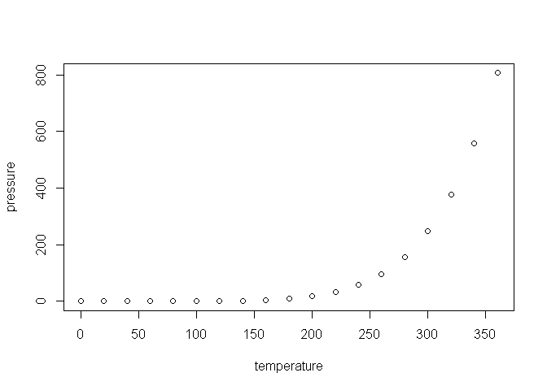

<!-- README.md is generated from README.Rmd. Please edit that file -->

# MD-ALL

#### Molecular Diagnosis of Acute Lymphoblastic Leukemia

<br>

## Installation

You can install the released version of MD-ALL from
[github](https://github.com/gu-lab20/MD-ALL) with:

``` r
devtools::install_github("gu-lab20/MD-ALL")
```

| Type        | Command                                             |
| ----------- | --------------------------------------------------- |
| Development | `remotes::install_github("XikunHan/metabolomicsR")` |

## Example

Basic example

``` r
library(MDALL)
## basic example code
```

##### Seamless workflow to preprocess, analyze, and visualize metabolomics data in metabolomicsR 
